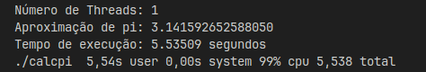
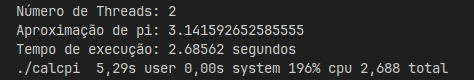
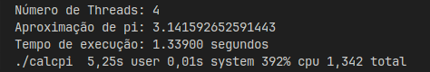
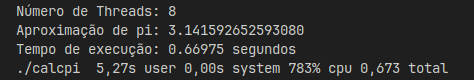
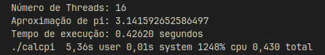

# Cálculo de PI com Threads utilizando a Fórmula de Leibniz

>**Disciplina:** Sistemas Operacionais
>**Equipe:** Carlos Eduardo, Leonardo Brito, Ludmila Barbosa, Vinicius Alves, Vitória Moreira
>**Curso:** Sistemas de Informação - 3º Período

## Explicação
- O código disponibilizado por meio deste repositório tem como objetivo explicar alguns conceitos da utilização de threads com base no cálculo de pi a partir da **Fórmula de Leibniz**.
- Este código foi escrito na linguagem de programação `C`, utilizando as bibliotecas `pthreads`, `time` e `math`.

## Visualizar a Aplicação
- Abra o seu terminal `linux` e rode os respectivos comandos:

### Para Compilar o Programa
```sh 
gcc -o calcpi calcpi.c -lm -lpthread 
```
### Para Executar o Programa
```sh
time ./calcpi
```
## Perguntas e Respostas

### As threads implementadas são preemptivas ou cooperativas? Explique sua resposta.
- São preemptivas, pois o sistema operacional para o qual o código foi projetado, assim como a biblioteca `pthreads`, trabalham de forma padrão com o escalonamento de threads, de modo que todas as threads - para essa operação - atuem com tempos de operação similares.

### Que modelo de threads o sistema operacional que você usou implementa (N:1, 1:1 ou N:M) ? Como isso pode ser deduzido a partir dos experimentos?
- Modelo 1:1, pois os sistemas operacionais baseados em Unix implementam esse tipo de mapeamento. Isso pode ser avaliado pois, com o aumento no número de threads (usuario), há também uma melhora na performance do programa, pois as threads são igualmente mapeadas (kernel).

## Testes
### Número de Threads: 1:



### Número de Threads: 2:



### Número de Threads: 4:



### Número de Threads: 8:



### Número de Threads: 16:

